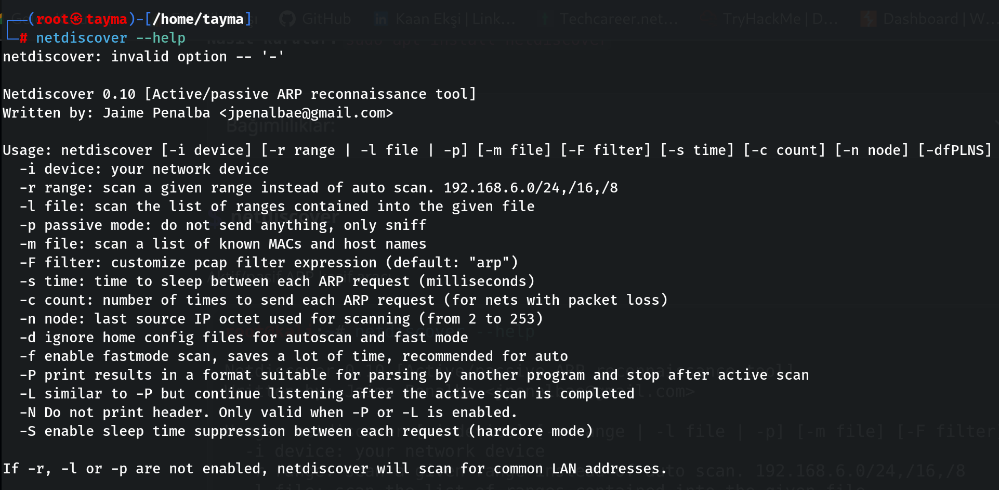

# Netdiscover

Netdiscover aracı ARP istekleri (Request) göndererek ağ taraması yapmamızı sağlayan bir Scan aracıdır.

---

*   -i cihaz: ağ cihazınız
*   -r aralık: otomatik tarama yerine belirli bir aralığı tarayın. 192.168.6.0/24,/16,/8
*   -l dosyası: verilen dosyanın içerdiği aralıkların listesini tarayın
*   -p pasif mod: hiçbir şey gönderme, sadece snif yap
*   -m dosyası: bilinen MAC'lerin ve ana bilgisayar adlarının listesini tarayın
*   -F filtresi: pcap filtre ifadesini özelleştirin (varsayılan: "arp")
*   -s zamanı: her ARP isteği arasındaki bekleme süresi (milisaniye)
*   -c sayısı: her ARP isteğinin gönderilme sayısı (paket kaybı olan ağlar için)
*   -n düğümü: tarama için kullanılan son kaynak IP sekizlisi (2'den 253'e kadar)
*   -d otomatik tarama ve hızlı mod için ana yapılandırma dosyalarını yoksay
*   -f hızlı mod taramayı etkinleştirir, çok zaman kazandırır, otomatik tarama için önerilir
*   -P yazdırma, başka bir program tarafından ayrıştırılmaya uygun bir formatta sonuçlanır ve aktif taramadan sonra durur
*  -L -P'ye benzer ancak aktif tarama tamamlandıktan sonra dinlemeye devam edin
*   -N Başlığı yazdırma. Yalnızca -P veya -L etkinleştirildiğinde geçerlidir.
*   -S her istek arasında uyku süresinin bastırılmasını etkinleştirir (sert mod)

-r, -l veya -p etkinleştirilmezse netdiscover ortak LAN adreslerini tarayacaktır.
